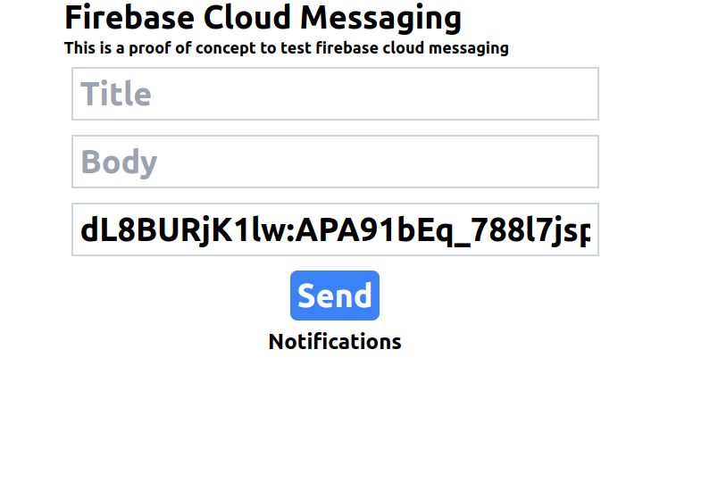

# Firebase Cloud Messaging With Nodejs

This is a simple example of how to send push notifications to Web, Android and iOS using Firebase Cloud Messaging (FCM) with Nodejs.

## Prerequisites

- Node.js
- Create a new project in the Firebase console
- Generate a new private key for the Firebase Admin SDK (firebase-credentials.json)
- Firebase Admin SDK
- Express
- Cors
- Dotenv

## Getting Started

1. Clone the repository:

```bash
git clone https://github.com/ZineddineBk09/Firebase-Cloud-Messaging-With-Nodejs.git
```

2. Install the dependencies:

```bash
npm install
```

3. Create a new file called .env and add the following environment variables:

```env
FIREBASE_PROJECT_ID=your-firebase-project-id
GOOGLE_APPLICATION_CREDENTIALS=firebase-credentials.json
```

4. Run the server:

```bash
npm start
```

5. Send a POST request to the /send endpoint with the following JSON body:

```json
{
  "title": "Hello",
  "body": "This is a test notification",
  "token": "your-device-registration-token"
}
```

6. I've also included a simple web pagein frontend folder to test the notifications. You can run it using the following commands:

```bash
cd frontend
```

```bash
python3 -m http.server 8000
```

7. Open your browser and go to http://localhost:8000, and a pop should appear asking for permission to send notifications.

8. If you accept, you can send a test notification by filling the form and clicking the "Send" button.

> [!IMPORTANT]  
> If everything is set up correctly, the token input should be automatically filled with the device registration token.
> 


## License

This project is licensed under the MIT License - see the [LICENSE](LICENSE) file for details.

## Acknowledgments

- [Firebase Cloud Messaging](https://firebase.google.com/docs/cloud-messaging)
- [Firebase Admin SDK](https://firebase.google.com/docs/admin/setup)
- [Express](https://expressjs.com/)
- [Cors](https://www.npmjs.com/package/cors)
- [Dotenv](https://www.npmjs.com/package/dotenv)
- [Node.js](https://nodejs.org/)

## Author

- **Zineddine Benkhaled** - [ZineddineBk09](https://github.com/ZineddineBk09)
